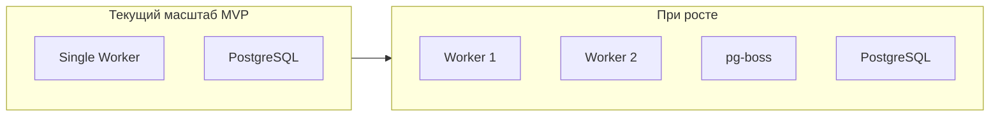

# Нефункциональные требования (NFR)

> Часть архитектуры Zamesin IS.
> Основной документ: [PLAN.md](../PLAN.md) | Архитектура: [02-architecture.md](02-architecture.md)
> Контекст: [requirements/system_requirements_context.md](../requirements/system_requirements_context.md)

Системный дизайн: масштабируемость, наблюдаемость, производительность, доступность.

---

## 14.1 Масштабируемость (Scalability)

### Текущая нагрузка

- **~1300 студентов/год** — ~10–20 фоновых задач (онбординг, уведомления) в день
- **~15 активных пользователей** (менеджеры, кураторы, админы)
- **Потолок потока**: ~220 студентов (при 500 всё ломается — текущая боль)
- **Цель**: масштабирование 10x выручки без роста команды

### Архитектура масштабирования

```
┌─────────────────────────────────────────────────────────────────┐
│  Текущий масштаб (MVP)                                          │
│                                                                  │
│  ┌──────────────┐     ┌──────────────┐                          │
│  │ Single Worker│     │  PostgreSQL  │                          │
│  │ (pg-boss)    │────▶│  (один инст.)│                          │
│  └──────────────┘     └──────────────┘                          │
└─────────────────────────────────────────────────────────────────┘

┌─────────────────────────────────────────────────────────────────┐
│  При росте нагрузки                                              │
│                                                                  │
│  ┌────────────┐ ┌────────────┐     ┌──────────────┐             │
│  │ Worker 1   │ │ Worker 2   │────▶│   pg-boss    │             │
│  │ onboarding │ │ payment    │     │ (PostgreSQL) │             │
│  └────────────┘ └────────────┘     └──────┬───────┘             │
│                                          │                       │
│                                          ▼                       │
│                                 ┌──────────────┐                │
│                                 │  PostgreSQL  │                │
│                                 │  (или master │                │
│                                 │  + replica)  │                │
│                                 └──────────────┘                │
└─────────────────────────────────────────────────────────────────┘
```

### Триггеры масштабирования

| Компонент      | Триггер                                              | Действие                                                                                    |
| -------------- | ---------------------------------------------------- | ------------------------------------------------------------------------------------------- |
| **Worker**     | Время ожидания в очереди > 1 мин для критичных задач | Запуск второго worker (pg-boss автоматически балансирует через FOR UPDATE SKIP LOCKED)      |
| **Worker**     | Разные приоритеты очередей                           | Разделение: onboarding._, payment._, notification.\* — отдельные worker'ы при необходимости |
| **PostgreSQL** | Нагрузка на чтение (аналитика, дашборды)             | Read replica для тяжёлых SELECT                                                             |
| **Redis**      | Не добавлять до MVP                                  | При необходимости — отдельное решение (кэш, rate limiting)                                  |

### Почему один worker достаточно на старте

- pg-boss обрабатывает тысячи задач/минуту на одном процессе
- ~10–20 задач/день — запас по производительности
- Простота деплоя и отладки: один процесс, один лог

---

## 14.2 Наблюдаемость (Observability)

### Логирование

- **Pino** — structured JSON logs → stdout ([02-architecture.md](02-architecture.md))
- **Ключевые поля в каждом логе**:
  - `trace_id` — привязка к process_id / job_id
  - `user_id` — контекст авторизованного пользователя (если доступен)
  - `process_id` — для сквозного трейса онбординга
  - `job_id` — для pg-boss Job

- **Логи не в БД** — только stdout (агрегация через внешний сервис при необходимости)

### Health checks

- **`/api/health`** — минимальный эндпоинт:
  - PostgreSQL: `SELECT 1`
  - pg-boss: проверка подключения к очереди
  - Внешние API (опционально): ping ЮKassa, Mailgun — только для расширенного мониторинга

### Метрики (MVP)

- **Не обязательно** на этапе MVP
- При необходимости: Prometheus + pg-boss stats (количество jobs в очереди, failed jobs)
- Dead jobs — через дэшборд менеджера (M.18) и уведомление в TG-чат команды

### Трассировка

- `trace_id` передаётся через весь стек: API → Сервис → Worker → Job
- Единый формат: `{ "trace_id": "proc_123", "job_id": "job_456", "msg": "..." }`
- Ошибки tRPC логируются централизованно на API-границе через глобальный `onError` handler (`fetchRequestHandler`).

### Наблюдаемость cron-задач

- Cron считается лёгким оркестратором: его задача — быстро поставить jobs в pg-boss и завершиться.
- KPI cron: время постановки и `enqueued_count`; KPI выполнения бизнес-операций — метрики downstream jobs.
- Каждый запуск cron пишет start/end логи с полями: `cron_name`, `job_id`, `trace_id`, `duration_ms`, `status`.
- Для каждого `cron_name` считаем метрики:
  - количество поставленных jobs (`enqueued_count`);
  - успешность запусков (`success_rate`);
  - время выполнения p95;
  - количество `failed/expired`;
  - lag между плановым и фактическим запуском.
- Алерт (MVP) поднимается, если:
  - cron не запускался дольше 2 интервалов расписания;
  - `failed/expired` подряд > 3 по одному `cron_name`;
  - lag cron-очереди > 5 минут для критичных задач доступа/биллинга.
- Ручной retry cron-job разрешён только для идемпотентных обработчиков и фиксируется в AuditLog (кто и когда ретраил).

---

## 14.3 Производительность

| Операция                       | Целевое время                                     |
| ------------------------------ | ------------------------------------------------- |
| Синхронный API (200 OK)        | < 500 ms                                          |
| Асинхронный API (202 Accepted) | < 2 s (размещение Job в очередь)                  |
| Webhook (acknowledgement)      | 200 OK в течение 1–2 сек                          |
| Тяжёлые операции               | В pg-boss (генерация PDF, email, TG, внешние API) |

### Принципы

- Тяжёлая работа — через pg-boss, не в request/response
- Сервисы выполняют синхронную логику (DB + постановка Jobs) в транзакции; тяжёлое — через pg-boss
- Индексы Prisma по [01-domain-model](01-domain-model.md) — соблюдать при запросах

---

## 14.4 Доступность (Availability)

- **Single region**: Яндекс Cloud
- **SLA**: не формализован на MVP
- **Backup PostgreSQL**: pg_dump или managed backup провайдера
- **Деплой**: Docker, один инстанс Next.js + Worker

---

## 14.5 Безопасность

- **RBAC**: [06-edge-cases.md](06-edge-cases.md) — 4 роли, B2B по связи
- **AuditLog + Event**: все мутации логируются
- **API keys**: в env vars, никогда в логах
- **Prisma**: параметризованные запросы (защита от SQL injection)
- **JSON-поля**: sanitization на входе (notes, answers, content)

---

## 14.6 Резервирование и восстановление

- **Минимальное на MVP**: backup БД, восстановление через `prisma migrate`
- **Disaster recovery**: план не формализован; при необходимости — отдельная проработка

---

## 14.7 Диаграмма масштабирования



---

## 14.8 Ссылки

- [02-architecture.md](02-architecture.md) — Worker, pg-boss, транзакционная оркестрация
- [06-edge-cases.md](06-edge-cases.md) — RBAC, безопасность
- [PLAN.md](../PLAN.md) — принятые технические решения
